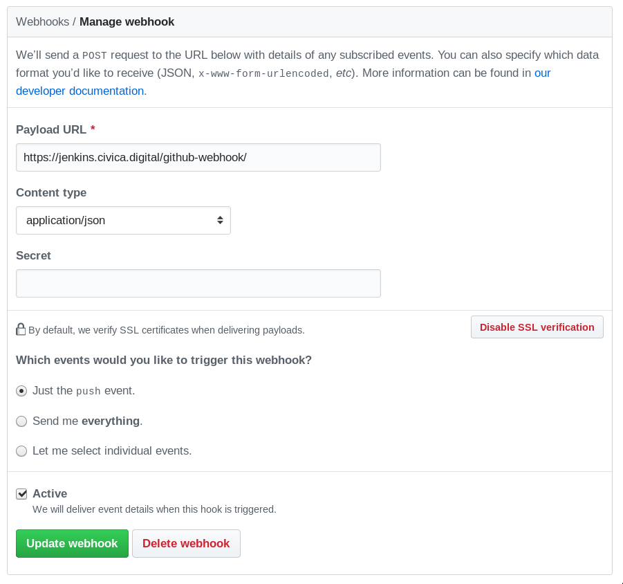
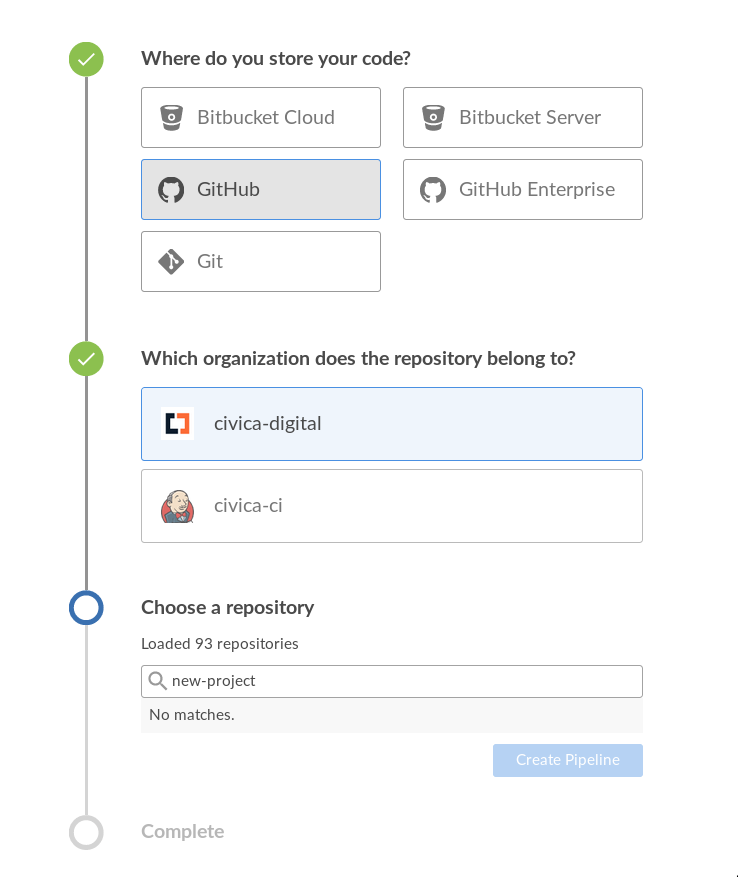

# Deploy
> Our deploy process, using Infrastructure as Code

## Stack
All our deploy use the following tools:

* `make`: https://www.gnu.org/software/make/
* `git-crypt`: https://github.com/AGWA/git-crypt
* `docker`: http://docker.com/
* `docker-compose`: https://docs.docker.com/compose/overview/
* `ssh`: https://en.wikipedia.org/wiki/Secure_Shell
* `rsync`: https://en.wikipedia.org/wiki/Rsync
* `aws` (Amazon Elastic Container Registry): https://aws.amazon.com/ecr/
* `terraform`: https://terraform.io/
* Jenkins: https://jenkins.io/doc/book/blueocean/

## Usage
After adding the template, you need to **set a webhook** in the GitHub
repository settings, to send a notification to Jenkins whenever someone
make a `push`.



Then **add the project** to Jenkins, going to https://jenkins.civica.digital/
and clicking the `New Pipeline` button:


Create a pipeline with the following:
**Github** -> `civica-digital` -> `name of your project`



Perform your first commit and you are all set!

## Deploy process
It starts with the `Jenkinsfile`, where we describe the stages of the
pipeline and its configuration (known as **Pipeline as Code**).

On it, we call instructions like the ones below:
```
bundle -> prepare -> test -> analyze -> deploy
```

Those instructions are commonly exposed through a `Makefile`
(as in `make test` or `make deploy`).

Some steps needs credentials, and we provide them as environment variables,
fetching them with the Jenkins `credentials` API.

Docker plays a core role in our infrastructure.

You can **not** compile a Ruby on Rails application into a single binary,
so, shipping an application means installing the _runtime_ and _buildtime_
environment in the _host_, and running several steps as _compiling assets_,
etc.

Docker help us to package all that stuff into an **image** that we can
distribute to a _host_ running a Docker daemon, without dealing with
more dependencies.

_For more information with Docker, refer to the [docker template](../docker/README.md)_

We use `docker-compose` to describe what images are going to run in the _host_.

> It's pretty simple, just a file that the developers can understand, as they
> use it in development. I prefer this instead of dealing with **Kubernetes**
> or another container orchestrator, as we don't write distributed technology.
>
> Also, we have a lot of _unknowns_ specifications of our clients infrastructure.
> We can **not** rely that they will allow their application run inside a **ECS**
> cluster, or to use more than one server to allow redundancy.
>
> It allow us the flexibility of running in any cloud provider.
>
> **We don't need a container orchestrator,
> improve your code instead of your infrastructure**.

If you take a look to the [Makefile][makefile], you will find a lot of
targets using `docker-compose`, that's because our Jenkins instance
doesn't have a `ruby` version installed, neither the project dependencies
(PostgreSQL, Redis, etc.), so we've prefered using `docker-compose`.

To provide the host where we are going to create the containers, we use
`Terraform` to describe how the infrastructure will look.

### Provisons
We wanted to declare the files that we are going to use in staging/production,
in a place with controlled access and version control.

The easiest and developer friendly way to do this, was using `git-crypt`.
a tool for encrypting some `git` files using PGP keys.

You can find an installation guide here: [git-crypt/INSTALL.md][git-crypt-install]

The provisions will look something like this:

```bash
deploy/staging/provisions
├── docker-compose.yml      # Describe the containers that are going to be run
├── environment             # ENV keys attached to the `web` service
└── traefik.toml            # Reverse proxy for the `web` container with SSL
```

All those files are going to be _provisioned_ to the server using: `make provide`
This instruction is part of the `deploy` process, for more information, refer
to the [Makefile][make] inside the `make` template.

### Scripts
To find out what the scripts do, there's a handy description as comments,
at the beginning of the `main` function includes meaningful instructions.

`setup-server.sh`:

```bash
# The intention of this script is to setup a server with the default
# configuration, documenting (infrastructure as code) the tasks
# that we normaly use in our staging/production environments.
#
# It should be runned with a user with `sudo` powers, that doesn't require
# password for it, as many commands requires root access and runs in
# a non-interactive environment.

# As we are running this with Terraform, it interprets the $ { var }
# as interpolation, that's why we are using the $var syntax

main() {
  create_user
  make_app_dir
  install_docker
  configure_docker
  install_docker_compose
  configure_docker_compose
  install_python_pip
  install_awscli
  configure_awscli
  configure_ssh
}
```

`update-container.sh`:

```bash
((${#} != 1)) && echo "Usage: update-container.sh IMAGE"

image=${1}

main() {
  login_to_aws
  download_image
  test_container
  run_migrations
  update_compose_file
  run_migrations
  run_seeds
  recreate_services
  clean
}
```

[git-crypt-install]: https://github.com/AGWA/git-crypt/blob/master/INSTALL.md
[makefile]: ../make/Makefile
